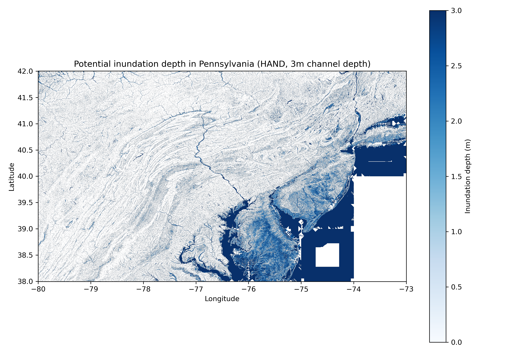

# Urban Sustainability Coursework

My lab work for the **AI for Urban Sustainability** course (University of Pennsylvania, instr. Xiaojiang Li).

## Lab 4 — Urban Flood Mapping (HAND model)

Estimates potential inundation depth across Pennsylvania from the USGS 1-arc-second (~30 m) DEM:

1. Download the 26 DEM tiles covering Pennsylvania from the USGS TNM staged products (one ocean tile, `n39w074`, does not exist).
2. For each tile: condition the DEM (fill pits → fill depressions → resolve flats) → D8 flow directions → flow accumulation → **HAND** (height above nearest drainage, channels = accumulation > 200 cells).
3. Assume a constant 3 m channel depth: inundation depth = 3 − HAND wherever 0 ≤ HAND < 3 m (negative HAND artifacts at ocean/no-data edges are masked).
4. Mosaic the per-tile results into one statewide GeoTIFF and render the map.

**Result:**



| File | Description |
|---|---|
| `lab4-urban-flood-mapping/lab4_floodmap_Qiwen_Bian.ipynb` | Full workflow notebook (outputs cleared) |
| `lab4-urban-flood-mapping/Lab4_Report_Qiwen_Bian.pdf` | Two-page lab report |
| `lab4-urban-flood-mapping/PA_inundation_map.png` | Statewide inundation map |

## Reproduce

```bash
conda env create -f env.yml && conda activate geospatial   # python 3.10 + rasterio/pysheds
jupyter lab lab4-urban-flood-mapping/
```

DEM tiles (~1.5 GB) and per-tile HAND results are **not** committed; the notebook downloads
them automatically when run.

> Course materials (instructor's notebooks, slides) are not redistributed in this repository;
> it contains my own work only.
