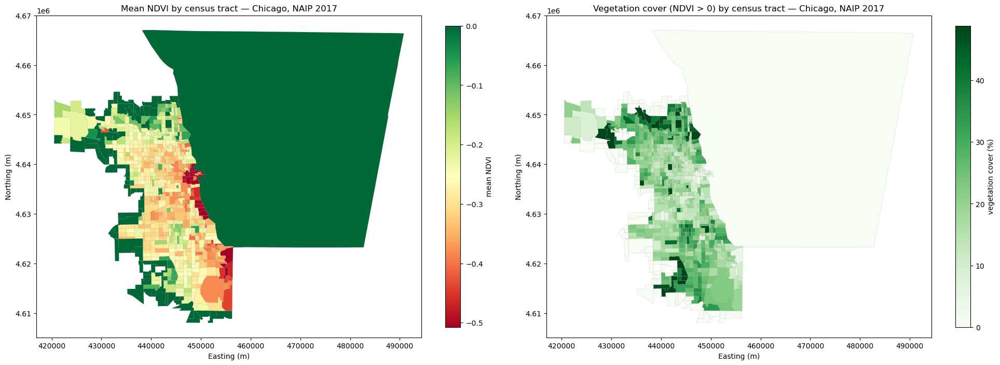

# Urban Sustainability Coursework

My lab work for the **AI for Urban Sustainability** course (University of Pennsylvania, instr. Xiaojiang Li).

## Lab 3 — NAIP Imagery, NDVI & Vegetation Cover (Chicago)

Measures urban greenness across Chicago with high-resolution NAIP CIR imagery (1 m, 2017):

1. Collect the Chicago city limit and Illinois census tracts (Census TIGER/Line shapefiles, committed in `data/`).
2. Search Microsoft Planetary Computer for NAIP tiles intersecting the city, keep the 34 tiles that actually overlap Chicago, and download the CIR rasters (~5.8 GB) into `cir-naip/`.
3. Mosaic the tiles, mask to the city boundary, and compute NDVI from the CIR bands (NIR, red).
4. Zonal statistics per census tract: mean NDVI and vegetation cover fraction (NDVI > 0).

**Result:**



| File | Description |
|---|---|
| `lab3-raster-data-manipulation/lab3_naip_Qiwen_Bian.ipynb` | Full workflow notebook with outputs |
| `lab3-raster-data-manipulation/chicago_ndvi_vegcover_map.png` | Mean NDVI / vegetation cover by tract |
| `lab3-raster-data-manipulation/data/*.shp` | TIGER/Line inputs and vector outputs (tracts, city limits, vegcover-by-tract) |

## Lab 4 — Urban Flood Mapping (HAND model)

Estimates potential inundation depth across Pennsylvania from the USGS 1-arc-second (~30 m) DEM:

1. Download the 26 DEM tiles covering Pennsylvania from the USGS TNM staged products (one ocean tile, `n39w074`, does not exist).
2. For each tile: condition the DEM (fill pits → fill depressions → resolve flats) → D8 flow directions → flow accumulation → **HAND** (height above nearest drainage, channels = accumulation > 200 cells).
3. Assume a constant 3 m channel depth: inundation depth = 3 − HAND wherever 0 ≤ HAND < 3 m (negative HAND artifacts at ocean/no-data edges are masked).
4. Mosaic the per-tile results into one statewide GeoTIFF and render the map.

**Result:**


| File | Description |
|---|---|
| `lab4-urban-flood-mapping/lab4_floodmap_Qiwen_Bian.ipynb` | Full workflow notebook (outputs cleared) |
| `lab4-urban-flood-mapping/Lab4_Report_Qiwen_Bian.pdf` | Two-page lab report |
| `lab4-urban-flood-mapping/PA_inundation_map.png` | Statewide inundation map |

## Reproduce

```bash
conda env create -f env.yml && conda activate geospatial   # python 3.10 + rasterio/pysheds
jupyter lab lab3-raster-data-manipulation/ lab4-urban-flood-mapping/
```

Lab 3 NAIP tiles (~5.8 GB), the Chicago mosaic (~24 GB) and Lab 4 DEM tiles (~1.5 GB) are
**not** committed (GitHub's 100 MB per-file limit); the notebooks download them automatically
when run.

> Course materials (instructor's notebooks, slides) are not redistributed in this repository;
> it contains my own work only.
